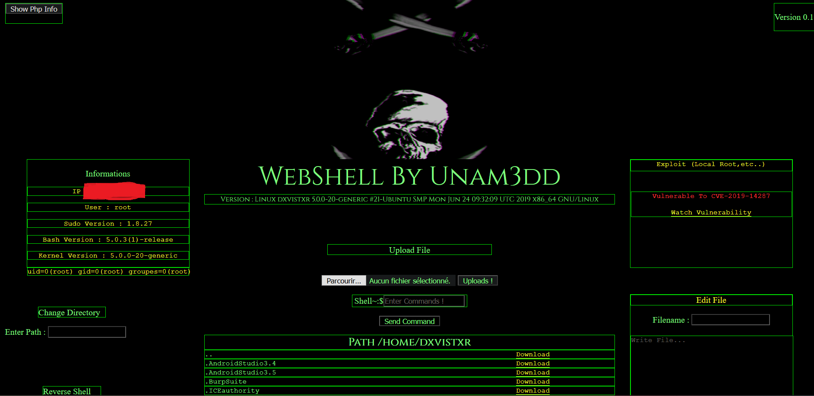
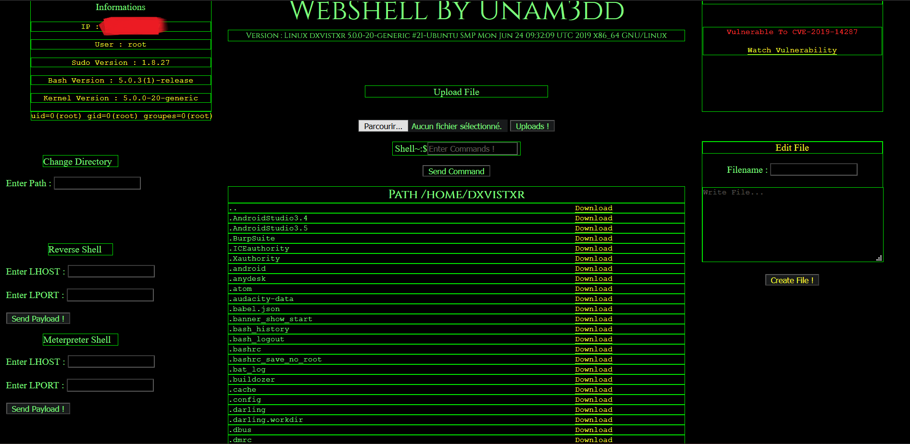

# MyFirstWebShell
Simple WebShell In Php

## WebShell :
   Execute Shell Command On WebsShell
   Edit File
   Get Interactive Reverse Shell
   Get Meterpreter Shell
   Check Exploit (CVE-2019-14287 if vulnerable get root shell with CVE-2019-14287)
   Show phpinfo
   Upload File
   Download File
   Change Dir
